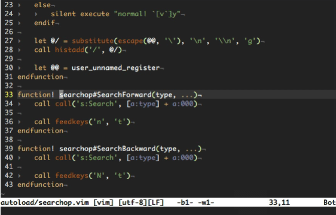

vim-searchop
============

Searchop provides operators to start searching using a motion. The included
operators are similar to the `#` and `*` commands, where instead of searching
for the keyword under the cursor, the motion becomes the search term.

## Demo

## License
Copyright © 2020 Teddy Wing. Licensed under the GNU GPLv3+ (see the included
COPYING file).
